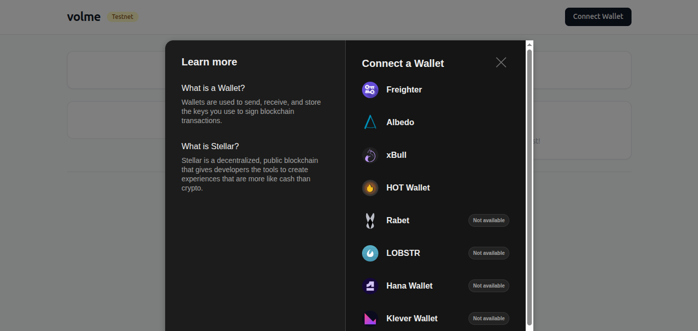
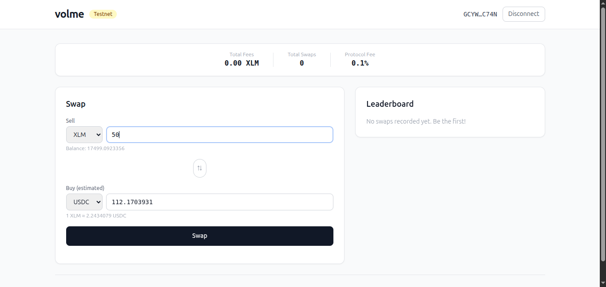
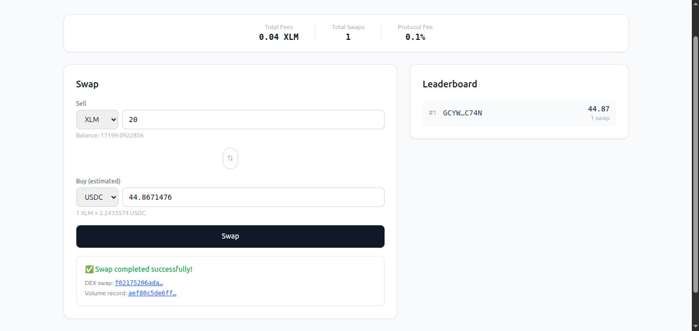

# Volme - Stellar Token Swap Interface with On-Chain Volume Tracking

Level 2 (Yellow Belt) of Stellar Journey to Mastery. A swap UI where users trade assets via the Stellar DEX orderbook (path payments), while a Soroban contract tracks each trader's volume and emits events powering a live leaderboard.

## Deployed Contract

| Network  | Contract ID                                   |
|----------|-----------------------------------------------|
| Testnet  | [`CACERGM6ATNGNVI33L3P5VJ2BCNRFBC4L5E3IGAIUZTTOBTRL7HDUE3N`](https://stellar.expert/explorer/testnet/contract/CACERGM6ATNGNVI33L3P5VJ2BCNRFBC4L5E3IGAIUZTTOBTRL7HDUE3N) |

**Contract invocation** (example):
```
stellar contract invoke \
  --id CACERGM6ATNGNVI33L3P5VJ2BCNRFBC4L5E3IGAIUZTTOBTRL7HDUE3N \
  --source <DEV_WALLET> --network testnet -- get_total_fees
```

**Deploy tx (WASM upload):** https://stellar.expert/explorer/testnet/tx/c22b5e25812f528b9d2dd2484be96ee4a5c30051bb31a023ac65f0dc77e8a54b

**Deploy tx (contract create):** https://stellar.expert/explorer/testnet/tx/d6d27fb41152e81b8ca28974c282436b4ec713f4850f6ab1b521a8607846741b

## Setup

### Prerequisites

- Rust toolchain (`wasm32v1-none` target)
- Stellar CLI 27+
- Node.js 22+

### Contract

```bash
# Build
stellar contract build --package volme_tracker

# Test
cargo test -p volme_tracker

# Deploy (requires funded key)
stellar contract deploy \
  --wasm target/wasm32v1-none/release/volme_tracker.wasm \
  --source <KEY> --network testnet

# Generate TypeScript bindings
stellar contract bindings typescript \
  --id CACERGM6ATNGNVI33L3P5VJ2BCNRFBC4L5E3IGAIUZTTOBTRL7HDUE3N \
  --network testnet --output-dir src/contract-bindings
```

### Frontend

```bash
npm install
# build the contract bindings first
npm run build --prefix src/contract-bindings
npm run dev
```

Open [http://localhost:3000](http://localhost:3000).

## Project Structure

```
├── app/                    # Next.js App Router pages
├── components/             # React components
│   ├── Header.tsx          # Wordmark, network badge, wallet connect
│   ├── SwapCard.tsx        # Asset swap form with path payment
│   ├── LeaderboardPanel.tsx# Ranked traders by volume
│   ├── StatsStrip.tsx      # Protocol fees, total swaps, fee rate
│   └── TransactionStatus.tsx # Status states with tx links
├── contracts/
│   └── volme_tracker/      # Soroban contract (Rust)
│       ├── src/lib.rs      # Contract logic
│       └── src/test.rs     # Unit tests
├── hooks/
│   ├── useWallet.ts        # StellarWalletsKit multi-wallet
│   ├── useSwap.ts          # DEX path payment + contract call
│   └── useLeaderboard.ts   # Polling leaderboard state
├── lib/
│   ├── stellar.ts          # Horizon/RPC clients, asset helpers
│   ├── contract.ts         # Contract client wrapper functions
│   └── contractClient.ts   # Generated typed contract client
└── src/contract-bindings/  # Generated TypeScript bindings
```

## Features

- **Multi-wallet support** via StellarWalletsKit (Freighter, xBull, Albedo, Rabet, Hana, WalletConnect)
- **Stellar DEX path payment** swaps with orderbook quotes
- **On-chain volume tracking** - 0.1% protocol fee, per-trader volume & swap count
- **Live leaderboard** - polls Soroban RPC every 5 seconds, refreshes on own swap
- **Protocol stats strip** - total fees collected, total swaps, fee rate display
- **Transaction status flow** - idle → quoting → awaiting signature → submitting swap → recording on-chain → success/failed
- **Error handling** - no wallets available, rejected connection, no liquidity, insufficient balance, contract call failure after successful swap

## Contract API

| Function              | Description                                |
|-----------------------|--------------------------------------------|
| `record_swap`         | Record a swap, take fee, emit event        |
| `get_total_fees`      | Total protocol fees collected              |
| `get_total_swaps`     | Total swaps recorded                       |
| `get_user_volume`     | Cumulative buy volume for a trader         |
| `get_user_swap_count` | Number of swaps by a trader                |
| `get_all_traders`     | List of all unique traders                 |

## Live Demo
https://volme.vercel.app/

## Screenshot





